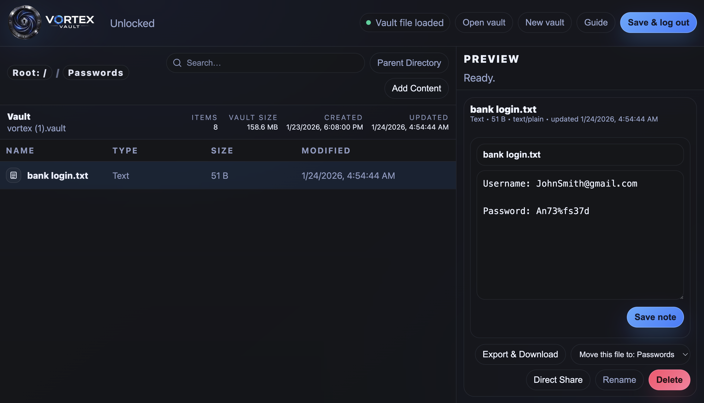

**Vortex Vault** is an offline, client-side encrypted vault that stores an entire file system inside a single `vortex.vault` container. Encrypted end-to-end in your browser using modern **WebCrypto (AES-256-GCM)**.

Unlock your vault locally, manage files like in a file explorer. Rename, or delete folders or files in your vault quickly and easily. View notes, images, videos, documents, and even audio all inside Vortex Vault. Vortex supports storing all conventional file types from .zip files to .wav files. Pressing **Save & log out** downloads your encrypted vault and clears the active browser session.

No accounts. No storage server. Just a vault you control.

### In-vault encrypted notes

### Direct Share (P2P, end-to-end encrypted)

### Media previews (images / video / PDF / audio)

---

## Why Vortex Vault exists

A lot of encryption tools are strong, but the workflow often breaks down when you want all of these at the same time:

- strong encryption
- **encrypted metadata** (not just file contents)
- **tamper detection**
- portable storage that works anywhere without installing an app
- the ability to keep backups wherever you want
- a clean, file-explorer style interface that doesn’t fight you
- a way to really securely share files **without uploading them to a server**

Vortex Vault is built to hit that sweet spot: simple enough for daily use, but serious enough for journalists, researchers, engineers, and teams who want strong security without needing a complicated stack.

---

## What makes it different

### A vault is a file system inside a file
A `vortex.vault` file isn’t just “encrypted files in a bundle.” It’s a structured container that holds:

- folders
- files (any binary format)
- encrypted text notes editable inside the vault
- previews for various media types
- an encrypted index that describes the whole vault

It behaves like a portable encrypted drive you carry as **one file**.

### The metadata is encrypted too
Some tools encrypt file contents but still leak file names, structure, and hints of what’s inside.

In Vortex Vault:

- the **vault index** (names, folder layout, types, timestamps, sizes) is encrypted
- records are encrypted individually
- tampering is detected automatically (AES-GCM integrity)

If someone steals your `.vault`, they don’t get filenames, folder structure, or clues about what’s inside.

### Offline-first, but still globally portable
Vortex Vault is designed to be safest offline, but it stays flexible:

- run locally from an HTML file on an offline machine
- run on an air-gapped device
- host it on a private intranet
- or use the official public endpoint at **vortex.mglabs.dev** to access the interface from anywhere

A `.vault` file is simply a file, so you can store it anywhere. On your local disk, USB drive, encrypted cloud storage, multiple publicly hosted backups, whatever you prefer. 

### Plausible real-world uses

- Investigative journalist crossing borders  
  A reporter keeps source identities, meeting notes, and draft stories inside a `.vault` file that’s mirrored across a couple of commodity VPS hosts. They travel with a “clean” device and pull the vault down from whatever computer they can access, then decrypt it in a browser using either the hosted client or a saved local HTML copy. If a laptop is searched or a server is scraped, the attacker gets a single opaque file: no filenames, no folder structure, no hints about which sources exist. For extra safety, the reporter keeps a harmless outer vault and a deeper vault with a separate passphrase for the most sensitive material.

- Safely documenting abuse or harassment  
  Someone quietly collecting evidence (photos, screenshots, audio notes, incident timelines) stores it in a `.vault` file that sits in ordinary cloud storage and a second copy on a removable drive. The key detail is metadata secrecy: even if the file is discovered, there’s nothing to preview, nothing to sort through, and nothing that reveals what’s inside or how it’s organized. They can later recover it from any device that has a modern browser, without depending on a specific app installation.

- Public-interest whistleblowing with staged disclosure  
  A whistleblower preserves emails, PDFs, and logs in a `.vault` file and shares only the encrypted blob (for example via a neutral file host), while distributing the passphrase through a separate channel. They use nested vaults to control blast radius: an outer vault contains non-identifying context suitable for initial legal review, while inner vaults contain originals and identifying details behind different passwords and stronger key-derivation settings. If any single key is compromised or coerced, deeper layers can still remain protected.

### Direct Share (peer-to-peer, encrypted, no file servers)
Vortex Vault includes **Direct Share**: a practical way to transfer a file directly between devices without uploading it to a third-party storage service.

<video src="VortexVaultSecureSend.mp4" width="720" controls></video>

- **Peer-to-peer transfer over WebRTC DataChannels**
- **No file hosting, no upload server, no storage backend**
- Application-layer encryption **in addition to** WebRTC transport encryption
- Receiver can either:
  - **download the decrypted file to their device** if they directly visit a share link in their browser), or
  - **import directly into their vault** if they already loaded their .vault file. In Vortex Vault you can click direct share on any file, then switch it to receive mode. From there you can simply paste the link sent to you and then send your generated link back to the sender.

Direct Share is built for real-world usability: generate a link, the receiver opens it, sends back a reply link, and the file transfers directly between browsers securely across the internet.

---

## Key features

### Secure vault container (v2 format)
- **AES-256-GCM** encryption (WebCrypto)
- **PBKDF2-SHA256** key derivation with a 1,000,000 iteration count
- Encrypted index + encrypted records
- Every record uses a fresh random **12-byte IV**
- The index is encrypted separately with its own IV
- Integrity is built-in via AES-GCM authentication

### Real file-explorer workflow
- Folders + nested organization
- Breadcrumb navigation
- Search for any of your files easily inside any folder
- Drag-and-drop import
- Rename / delete
- Export any file back out

### In-vault notes (editable)
- Create encrypted text notes
- Edit in place
- Save updates without leaving the app

### Previews & media support
- Image viewer
- Video player
- PDF viewer
- Audio player

### Privacy-aware imports (anti-fingerprinting)
Vortex Vault isn’t only “encrypt the bytes.” When you import content, it can apply privacy-focused transformations that reduce tracking/correlation across systems.

Current strongest privacy handling is implemented for visual media:

- **Images** are decoded and re-encoded as PNG:
  - strips metadata by design
  - max dimension size of 4,000px by 4,000px to reduce extreme inputs
  - output is normalized (`.png`)
- **Videos** may receive small randomized trailing padding (only when safe) to change file hashes without breaking playback

This is version **1.0**. Over time, privacy transforms may expand to additional file types where it’s practical and safe (without corrupting the file), while keeping the core offline workflow intact.

---

## Start Guide

This is the safest and simplest way to use Vortex Vault.

1. Download the `VortexVault.html` file from this repo, or load it from the offical public link: https://vortex.mglabs.dev, or load it from your self-hosted source.
2. Open the app:
   - open the html file in a modern browser
   - or visit the offical public link to load it on almost any device anywhere
3. Click **New vault** to make a new `vortex.vault` file or **Open Vault** to load an existing one.
4. Use a strong password  
   - minimum **12 characters**
   - must include **uppercase, lowercase, numbers, and symbols**
5. Add content:
   - **Add Content** → Import files / Paste files or text / Make new folders / make new text notes 
   - or drag-and-drop into the file list
6. When done, click **Save & log out**
   - your encrypted `vortex.vault` file downloads
   - the active session is cleared

To reopen later: **Open vault** → select your `vortex.vault` file → enter password.

---

## Access it from anywhere (advanced, still user-friendly)

If you want maximum portability across devices, you can use Vortex Vault like this:

- keep your `vortex.vault` file stored somewhere reachable (local drive, encrypted cloud storage, private server, etc.)
- on any device, open the official client at **vortex.mglabs.dev**
- download your vault file or select your `.vault` file
- unlock it locally (decryption happens on your device, not on a server)

This is a real advantage of the “vault is a file” model: it can be as portable as cloud apps while still staying client-side encrypted.

If you’re operating in high-risk situations, offline/local usage remains the recommended approach. If you want convenience and global access, the hosted client model is viable — just treat the client code as a security-critical dependency and verify you’re loading the official domain (`vortex.mglabs.dev`).

---

## Direct Share (peer-to-peer encrypted file transfer)

Direct Share is designed to be **fast, link-based, and serverless for file data**.

### What it is
Direct Share uses **WebRTC** to establish a direct encrypted channel between two browsers. You share a link (the offer), the receiver opens it and generates a reply link (the answer), and the sender applies it to start the transfer.

### What “double encrypted” means here
Direct Share benefits from two layers of encryption:

1. **Transport encryption (WebRTC)**  
   WebRTC DataChannels are encrypted in transit by the protocol itself.

2. **Application-layer payload encryption (Vortex Vault)**  
   Vortex Vault additionally encrypts the transferred file bytes using:
   - **AES-256-GCM**
   - **PBKDF2-SHA256** key derivation
   - a one-time random salt + IV per transfer
   - a mutual secret derived from both users’ one-time security codes

This means even if a transfer were somehow recorded at the transport level, the file payload is still encrypted as ciphertext.

### How to send a file
1. Unlock your vault
2. Select a file
3. Click **Direct Share**
4. Send the generated link to the receiver
5. The receiver opens the link and sends you back a reply link
6. Paste the reply link into your Direct Share menu
7. Click **Send File**

### How to receive a file
1. Open the sender’s link
2. Vortex Vault generates a reply link automatically
3. Send the reply link back to the sender
4. When the transfer completes:
   - if your vault is already loaded and unlocked, and you opened the Direct Share menu, you can paste a link sent to you, and the file imports into your vault.
   - if your vault is not already loaded and unlocked, the file downloads to your device like any other file.

### Important operational notes
- Direct Share uses STUN to help peers connect (NAT traversal).  
  This does **not** store your file on servers, but it can expose network metadata (like IP addresses) to the peer you’re connecting with, which is normal for P2P.
- Direct Share intentionally does **not** rely on TURN relays by default.  
  This keeps the “no relay servers” posture, but very restrictive networks may fail to connect.

---

## How Vortex Vault works (high-level)

Vortex Vault is a pure client-side application:

- All cryptography happens locally using the browser’s WebCrypto API.
- Your vault file stays encrypted on disk.
- Decryption happens only when you unlock the vault.
- Decrypted bytes exist in memory only for active use (preview/export/share).
- When you add or remove files to your vault, click **Save & log out** to download a newly encrypted `vortex.vault` file and clear the session.

No server is required to use Vortex Vault, it is possible to store and access the html file locally.

---

## Vault format (`.vault`)

Vaults use a compact container format:

- Header with:
  - magic bytes (`AVLT`)
  - version
  - PBKDF2 iteration count
  - KDF salt
  - encrypted index length
  - index IV
- Encrypted index:
  - JSON describing meta + items (names, timestamps, folder structure, record offsets)
- Encrypted records:
  - each record is stored as `[IV(12) || AES-GCM(ciphertext+tag)]`

### Record model
Each item in the index describes either:
- a **folder** (no record bytes), or
- a **record-backed item** (file/image/video/text)

Text notes are stored as encrypted records as well, but the editor can hold pending plaintext in memory until you save.

### Legacy v1 support
Older vaults (v1) from the prototype phase of Vortex Vault are supported for opening.
When you **Save & log out**, v1 vaults are upgraded and re-saved as a v2 container automatically.

---

## Passwords & key derivation

Vortex Vault uses PBKDF2 (SHA-256) to derive the encryption key from your password.

- Default vault KDF iteration count is 1,000,000 (designed to slow brute-force attempts).
- Password rules are enforced when creating a new vault:
  - minimum length: **12**
  - must include: uppercase, lowercase, number, symbol

Recommendation: use a long passphrase you can type reliably. PBKDF2 helps, but password strength still matters.

---

## Supported file types (practical view)

Vortex Vault can store **any file type** as encrypted bytes.

### Preview / playback inside the app
- Images
- Videos
- PDFs
- Audio files
- Text notes (editable)

### Import-time transformations
- Images: re-encoded to PNG, metadata stripped, size normalized
- Videos: attempts adding trailing padding when safe to alter hashes without breaking playback
- Other files: stored as-is (encrypted), no transformation applied to not risk corrupting your files. In future releases, we are considering hash changes or normalization for more file types.

---

## Security model (what it protects well)

Vortex Vault is built to protect against:

- unauthorized access to your vault file at rest
- exposure of file names, folder structure, timestamps, sizes
- tampering or silent modification of vault contents
- server-side compromise risks (because there is no server that holds your vault data)

In other words: if someone obtains your `vortex.vault` file, the design is intended to keep its contents and structure private unless the password is known.

---

## Practical threat notes (what to keep in mind)

- If an attacker can run malicious code on your device while your vault is unlocked, they can potentially access decrypted content.
- If you load the client from the public internet, your security depends on the integrity of what you loaded (use the official domain, or run it locally/offline).
- Direct Share is peer-to-peer: the peer you connect to can see your connection metadata (typical for P2P). We recommend using it to send files between people you know and trust.

---

## Limits & performance notes

Vortex Vault is optimized for being practical inside a browser tab, but browsers have finite memory.

Notable internal guardrails:
- Pending unsaved data is capped to prevent memory blowups on typical devices.
- Direct Share receiving has a hard memory cap (to prevent “RAM nukes”).

If you intend to handle large files (over 2GB), consider splitting them or testing on the target hardware/browser.

---

## Keyboard shortcuts

- **Ctrl/Cmd + F** — Search
- **Ctrl/Cmd + I** — Import files
- **Ctrl/Cmd + N** — New text note
- **Ctrl/Cmd + S** — Save & log out (downloads vault + clears session)
- **Esc** — Close modals

---

## Browser requirements

You need a modern browser with:
- WebCrypto (`crypto.subtle`)
- Blob / File APIs
- WebRTC (for Direct Share)

Recent Chrome / Edge / Firefox / Safari should work. If WebCrypto is unavailable, the app will warn you.

---

## License

This project is open source under GNU AGPL v3.0. See **LICENSE** for details.

---

## Contributing

Contributions are welcome — especially in areas like:

- expanding safe privacy transformations for additional file types
- improving large-file handling and streaming workflows
- UX improvements that preserve the “offline-first” posture
- security review and hardening

---

If you want a vault that’s easy to carry, easy to back up, and hard to analyze or tamper with, Vortex Vault is built for that exact job.
