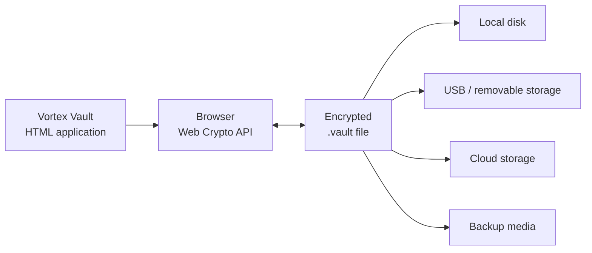
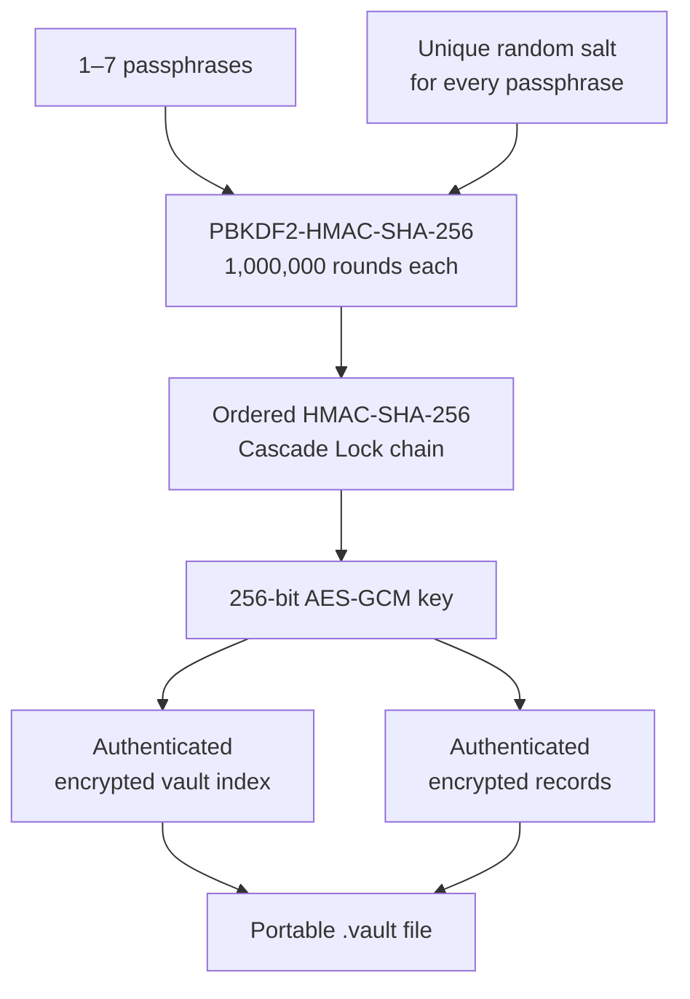
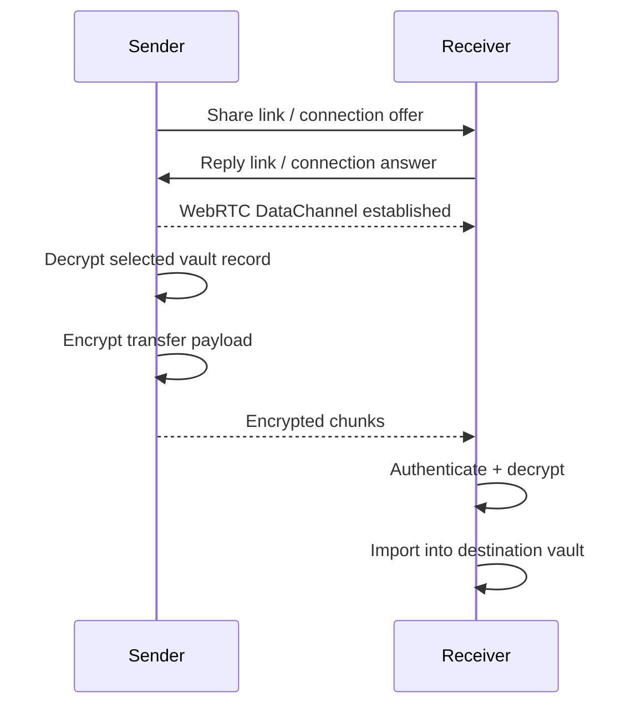

<div align="center">

# ◈ VORTEX VAULT

### A portable, local-first encrypted workspace.

**Files · Photos · Passwords · Authenticator · Direct Share**

<br>


<br><br>

**Vortex Vault turns one portable `.vault` file into a private encrypted workspace you control.**

No account is required.
No storage backend is required.
Your encrypted vault can live on your computer, an external drive, removable media, or any storage provider you choose.

Try it on almost any device: https://vortex.mglabs.dev (client loads there, vault decrypts locally)

<br>

[What is Vortex?](#what-is-vortex-vault) ·
[How it works](#how-it-works) ·
[Features](#features) ·
[Security](#security-architecture) ·
[Cascade Lock](#cascade-lock) ·
[Direct Share](#direct-share) ·
[Threat model](#threat-model)

</div>

---

## What is Vortex Vault?

Vortex Vault is a **self-contained browser-based encrypted workspace** built around a simple idea:

> Your private data should be stored in a file that **you own, you move, and you control**.

Instead of placing your data into an online account or application database, Vortex stores protected content inside a portable encrypted `.vault` container.

The application itself is delivered as a single HTML file and performs its cryptographic operations locally using the browser's native **Web Crypto API**.

A vault can contain much more than ordinary files.

| Workspace         | Purpose                                                                    |
| ----------------- | -------------------------------------------------------------------------- |
| **Files**         | Folders, documents, notes, images, video, audio, PDFs, and arbitrary files |
| **Library**       | Photo and video browsing with encrypted albums                             |
| **Passwords**     | Encrypted login credentials and password generation                        |
| **Authenticator** | Offline TOTP authentication codes                                          |
| **Direct Share**  | Peer-to-peer encrypted file and folder transfers                           |
| **Settings**      | Vault protection and Cascade Lock configuration                            |

Everything belongs to the same encrypted portable workspace.

---

## The design philosophy

Vortex is built around four principles.

### ◇ Local-first

Vault processing happens in the browser on the device where Vortex is running.

The application does not require a remote database to hold the contents of your vault.

### ◇ Portable

The encrypted `.vault` file is the data store.

Move it.

Copy it.

Back it up.

Put it on removable storage.

Store an encrypted copy with the storage provider of your choice.

The vault is not tied to one installation of Vortex.

### ◇ Offline-capable

Core vault functionality does not depend on an internet connection.

Opening, browsing, encrypting, decrypting, editing, managing passwords, and generating TOTP codes can operate locally.

Network connectivity is only needed for features that inherently communicate with another device, such as Direct Share.

### ◇ Encryption before storage

Sensitive vault content is encrypted before it becomes part of the saved vault container.

The portable file is designed to remain unintelligible without the required vault passphrase or passphrase sequence.

---

# How it works

At a high level, Vortex separates the application from the encrypted data.



The `.vault` file is portable.

The application knows how to unlock it, authenticate it, decrypt individual records when needed, modify the workspace, and produce a newly encrypted vault when saved.

---

## Opening a vault

When you open a modern Vortex vault:

1. Vortex reads the small container header.
2. Untrusted header parameters are validated before expensive cryptographic work is performed.
3. Your passphrase — or ordered Cascade Lock passphrases — is processed through the configured key derivation.
4. A 256-bit AES key is created using the browser's Web Crypto implementation.
5. The encrypted vault index is authenticated and decrypted.
6. Individual encrypted records are decrypted only when their contents are needed.

If authenticated decryption fails, the vault is not accepted.

For Cascade Lock vaults, there is intentionally **no successful intermediate passphrase check**. Authentication only succeeds after the entire ordered sequence has produced the final key.

---

## Saving a vault

Vortex rebuilds the portable encrypted container when you choose **Save & log out**.

Records that have not changed can remain encrypted and be copied directly from the existing container, while modified or newly added records are encrypted before being written into the new vault.

After saving, Vortex clears the active vault session.

> [!TIP]
> The `.vault` file is the important data. Treat it like any other important encrypted archive: maintain backups and periodically verify that those backups can be opened.

---

# Features

## 📁 Files

The Files workspace behaves like a lightweight encrypted file manager.

**Included functionality:**

* Nested folders
* Breadcrumb navigation
* Search
* Sorting
* Drag-and-drop organization
* Rename and delete
* File import
* Clipboard paste
* Text note creation and editing
* File export
* Resizable preview pane
* Images
* Video
* Audio
* PDF preview
* Arbitrary binary files

Files are stored as encrypted records inside the vault rather than as ordinary loose files alongside the application.

---

## 🖼️ Library

Library provides a media-oriented view of the images and videos already stored in the vault.

It does **not** duplicate or relocate those files.

The Library is another view over the same encrypted records.

### Media features

* Browse all media
* Filter photos
* Filter videos
* Full-screen media viewer
* Previous / next navigation
* Keyboard navigation
* Export media
* Delete media
* Create albums
* Add media to albums
* Remove albums without deleting their files

Album membership is stored as protected vault metadata referencing the original media records.

That means one photograph does not need to be copied several times simply because it appears in multiple organizational views.

---

## 🔑 Passwords

Vortex includes a password manager directly inside the encrypted workspace.

A credential can contain:

* Name
* Username or email
* Password
* Website
* Notes

Passwords can be:

* Hidden or revealed
* Copied when needed
* Searched
* Edited
* Deleted
* Generated using cryptographically secure randomness

Password entries are stored as encrypted vault records and are separated from the ordinary Files view.

---

## ⏱️ Authenticator

Vortex can also generate **TOTP — Time-based One-Time Password — codes** completely locally.

Supported input includes:

* Base32 setup secrets
* `otpauth://totp/...` URIs
* QR scanning through the browser's native QR capabilities when available

Supported configurations include:

| Setting            | Support        |
| ------------------ | -------------- |
| SHA-1              | ✓              |
| SHA-256            | ✓              |
| SHA-512            | ✓              |
| 6 digit codes      | ✓              |
| 8 digit codes      | ✓              |
| Custom period      | 15–120 seconds |
| Offline generation | ✓              |

QR scanning is performed locally. Vortex does not need to upload the QR image to decode an authenticator setup.

> [!IMPORTANT]
> Storing a site's password and its TOTP seed in the same vault is convenient, but it does not provide the same factor separation as keeping the second factor on an independent hardware authenticator or separate trusted device.

---

# Security architecture

Vortex uses established browser cryptographic primitives rather than implementing encryption algorithms from scratch in JavaScript.

| Component                | Design                                    |
| ------------------------ | ----------------------------------------- |
| Authenticated encryption | **AES-256-GCM**                           |
| Key derivation           | **PBKDF2-HMAC-SHA-256**                   |
| Default work factor      | **1,000,000 iterations per passphrase**   |
| Cascade Lock             | **1–7 ordered passphrases**               |
| Cascade composition      | **HMAC-SHA-256**                          |
| Randomness               | Browser cryptographic RNG                 |
| Modern record IV         | Random 96-bit AES-GCM IV                  |
| Cascade salt             | Unique random 128-bit salt per passphrase |
| Active AES key           | Non-extractable Web Crypto `CryptoKey`    |
| Index                    | Encrypted and authenticated               |
| Modern records           | Independently encrypted and authenticated |
| Record identity binding  | AES-GCM Additional Authenticated Data     |

---

## Security flow



---

# Cascade Lock

Cascade Lock allows a modern Vortex vault to require between **one and seven ordered passphrases**.

This is not implemented as a series of separately unlockable encrypted layers.

That distinction is important.

If each password independently unlocked one encryption layer, an attacker could potentially test and crack each layer separately.

Vortex instead derives a single final vault key from the **entire ordered sequence**.

---

## How Cascade Lock derives a key

For every passphrase:

1. A unique random 16-byte salt is generated.
2. The passphrase is processed with **PBKDF2-HMAC-SHA-256**.
3. PBKDF2 performs **1,000,000 iterations**.
4. The resulting 256-bit value is incorporated into an ordered HMAC-SHA-256 chain.
5. Each stage includes domain separation, its position in the sequence, and the vault's random identifier.
6. After the final passphrase, another domain-separated HMAC operation produces the raw AES key material.
7. The result is imported into Web Crypto as a **non-extractable AES-256-GCM key**.

The order matters cryptographically.

For example:

```text
Passphrase A → Passphrase B → Passphrase C
```

does not derive the same key as:

```text
Passphrase C → Passphrase B → Passphrase A
```

---

## No intermediate password oracle

Cascade Lock deliberately avoids storing a verifier for each individual passphrase.

Vortex therefore cannot tell an attacker:

```text
Passphrase 1 was correct.
Passphrase 2 was wrong.
```

The complete chain must be derived first.

Only the final authenticated vault index determines whether the entire sequence was correct.

If authentication fails, the sequence is rejected as a whole.

---

## Cascade unlock memory behavior

During Cascade Lock unlock, Vortex processes passphrases sequentially.

After each stage:

* The password field is cleared.
* The PBKDF2-derived intermediate material is no longer needed.
* Temporary byte buffers are overwritten where practical.
* Only the cryptographic chain state needs to continue to the next stage.

The final AES key is imported as a Web Crypto key marked **non-extractable**.

> [!NOTE]
> JavaScript strings and browser memory cannot be guaranteed to be physically erased. Vortex performs best-effort cleanup, but the browser and operating system ultimately control memory allocation, copying, swapping, and process inspection.

---

# Authenticated encryption

Encryption alone is not enough.

Vortex uses **AES-GCM**, which provides both:

* Confidentiality
* Authentication

This means encrypted data is not only hidden — modifications to authenticated ciphertext are detected.

If encrypted data is altered without the correct key, authenticated decryption fails.

---

## Encrypted index

The vault's index contains the structure needed to understand the workspace.

That includes information such as:

* Item records
* Folder relationships
* Media organization
* Vault metadata
* Record offsets and lengths
* Password and authenticator record references

The index is encrypted with AES-256-GCM.

The plaintext container header contains only the structural and cryptographic information necessary to determine how the vault should be opened.

---

## Per-record encryption

Files and secure records are not stored as one enormous plaintext structure.

They are represented as independently encrypted records.

Modern Vortex records use:

* AES-256-GCM
* A fresh random IV
* Authentication tags
* Record identity binding

For the modern internal container, each record's immutable item ID is supplied to AES-GCM as **Additional Authenticated Data**.

Conceptually:

```text
Ciphertext + Authentication Tag + Expected Record ID
                         │
                         ▼
                  AES-GCM verification
```

This makes a ciphertext record cryptographically associated with the identity it belongs to.

A valid encrypted record cannot simply be moved and presented as another record without authentication failing.

---

# Cryptographic parameter validation

The vault header must be readable before the vault can be unlocked, which means it is attacker-controlled input.

Vortex therefore validates cryptographic and allocation parameters before performing expensive work.

Modern vault validation includes checks such as:

* Supported format version
* Supported KDF suite
* Supported cipher suite
* Valid Cascade Lock count
* Expected header size
* Expected fixed KDF work factor
* Valid salt sizes
* Valid vault identifier
* Reasonable encrypted index size
* Verification that the declared index actually fits within the file

This prevents a modified plaintext header from simply requesting absurd resource consumption or impossible allocations before authentication occurs.

---

# Rekeying

Vault protection can be changed from the Settings workspace.

A vault can be migrated to a new Cascade Lock configuration using between one and seven new passphrases.

The migration is performed as an application-level atomic operation:

1. New key material is derived.
2. Existing records are decrypted one at a time.
3. Each record is re-encrypted with the new key.
4. A new encrypted record set is built separately.
5. The active vault state changes only after all records have been processed successfully.

If migration fails before completion, the existing unlocked vault state remains available rather than being partially replaced by a half-rekeyed container.

---

# Password handling

Vortex applies several defensive practices around vault passwords.

### New passphrase requirements

New vault passphrases must contain:

* At least 12 characters
* Uppercase character
* Lowercase character
* Number
* Symbol

When multiple Cascade Lock passphrases are used, each passphrase must be different.

### After derivation

For modern vaults, the original master passphrase string is not required after the cryptographic key has been derived.

Vortex retains the derived non-extractable Web Crypto key for the unlocked session rather than intentionally keeping the user's master password in application state.

### Intermediate material

Sensitive temporary byte arrays are overwritten where practical after use.

This includes several intermediate PBKDF2, HMAC, and plaintext buffers.

---

# Privacy-oriented file handling

Vortex applies additional privacy-oriented processing to some imported media.

## Images

Raster images are decoded and re-encoded as PNG before storage.

This has useful privacy properties:

* Embedded image metadata is discarded during re-encoding.
* EXIF metadata is not copied into the new PNG.
* Images are constrained to a maximum dimension to reduce pathological resource usage.
* A smaller thumbnail can be created for the Library.

The thumbnail is stored inside protected vault metadata rather than as an exposed sidecar file.

## Video

For compatible MP4/MOV-style containers, Vortex can append a valid randomized `free` padding box.

This changes the resulting file hash without corrupting the media container and can reduce stable byte-for-byte fingerprinting of an imported copy.

Formats where trailing or container padding could create compatibility problems are left untouched.

---

# Direct Share

Direct Share allows files to move between devices without first uploading the file contents to a Vortex storage server.

It uses a browser **WebRTC DataChannel**.



STUN services may assist the browsers in discovering how to establish a peer connection, but the shared file payload itself is sent through the WebRTC peer connection rather than being stored in a Vortex file server.

---

## Multi-file and folder sharing

Direct Share supports more than one file.

You can select:

* Individual files
* Multiple files
* Folders
* Multiple folders
* Mixed file/folder selections

Selecting a folder recursively includes its descendants.

Vortex creates a temporary transfer manifest that describes the bundle hierarchy without transmitting the original internal vault record IDs.

The receiving Vortex workspace can reconstruct the folder hierarchy inside the destination vault.

---

## Transfer encryption

A Direct Share session derives a separate transfer key.

Each transferred file is encrypted using AES-GCM with:

* A per-file random IV
* Authenticated encrypted contents
* Authenticated metadata describing that transfer entry

The receiving side verifies authentication before accepting the plaintext.

If the receiver already has a vault unlocked, received data can immediately be encrypted under the receiver's own vault key before becoming part of that vault.

---

> [!IMPORTANT]
> Direct Share link exchange is part of the trust model.
>
> Exchange the sender and receiver links through a channel you trust and verify that you are communicating with the intended person.
>
> WebRTC peer connections may also expose network information such as peer IP addresses to the other participant.

---

# Security best practices used by Vortex

Vortex intentionally follows several defensive design patterns.

### ✓ Native browser cryptography

Encryption, hashing, PBKDF2, and HMAC use the browser's Web Crypto implementation.

Vortex does not implement AES itself in handwritten JavaScript.

### ✓ Authenticated encryption

AES-GCM detects unauthorized ciphertext modification.

### ✓ Cryptographically secure randomness

Salts, vault identifiers, IVs, IDs, and cryptographic random material use the browser cryptographic random-number generator where appropriate.

### ✓ Unique salts

Every Cascade Lock passphrase receives its own random salt.

### ✓ Fresh encryption IVs

AES-GCM encryption operations use fresh random initialization vectors.

### ✓ Domain-separated Cascade Lock

Different stages of Cascade Lock use explicit domain strings so the cryptographic operations have distinct purposes.

### ✓ No partial Cascade verifier

Individual passphrases do not receive independent success/failure verifiers.

### ✓ Non-extractable active vault key

The final modern AES key is imported into Web Crypto as non-extractable.

### ✓ Record identity authentication

Modern encrypted records are bound to their immutable item identity using AES-GCM Additional Authenticated Data.

### ✓ Encrypted workspace metadata

The useful vault index is authenticated and encrypted.

### ✓ Bounds checking before KDF work

Attacker-controlled header parameters are validated before expensive operations.

### ✓ Best-effort memory cleanup

Sensitive temporary byte buffers are overwritten after use where practical.

### ✓ Local media sanitization

Raster image imports are re-encoded rather than preserving embedded metadata.

### ✓ Atomic rekeying

A failed migration does not intentionally replace the active vault with a partially migrated state.

---

# Why PBKDF2?

Vortex currently uses **PBKDF2-HMAC-SHA-256** because PBKDF2 is available directly through the browser's native Web Crypto API.

Modern Vortex uses:

```text
1,000,000 PBKDF2 iterations
per Cascade Lock passphrase
```

Using seven passphrases therefore requires seven independent million-round PBKDF2 derivations before the final Cascade Lock key can be produced.

There is an important technical distinction, however:

> [!NOTE]
> PBKDF2 is computationally expensive, but it is **not memory-hard**.
>
> Algorithms such as Argon2id can provide stronger resistance to highly parallel specialized password-cracking hardware by requiring substantial memory as well as computation.

Vortex currently favors native Web Crypto and a self-contained implementation instead of introducing a large security-critical third-party cryptographic/WASM dependency.

Strong, unpredictable passphrases remain extremely important.

Seven weak passwords are not automatically equivalent to one enormous uniformly random secret.

---

# Threat model

Vortex is primarily designed to protect the **vault file at rest**.

Examples include:

* A stolen USB drive
* A copied `.vault` file
* A lost backup
* A cloud-storage copy
* Someone obtaining the encrypted file without the passphrase
* Unauthorized modification of encrypted records

With a strong passphrase or Cascade Lock sequence, the goal is for possession of the `.vault` file alone to be insufficient to recover its protected contents.

---

## What Vortex can protect

| Scenario                                                     | Protection                                                |
| ------------------------------------------------------------ | --------------------------------------------------------- |
| Someone obtains only the encrypted `.vault` file             | **Designed to protect**                                   |
| Someone modifies authenticated ciphertext                    | **Detected by AES-GCM**                                   |
| Someone swaps modern encrypted record ciphertext between IDs | **Detected by record authentication**                     |
| Cloud provider can see stored `.vault` bytes                 | **Contents remain encrypted**                             |
| USB drive containing vault is lost                           | **Contents remain encrypted**                             |
| Attacker guesses passwords offline                           | **KDF increases cost; password entropy remains critical** |

---

## What encryption cannot solve

Vortex cannot make a compromised machine trustworthy.

If an attacker controls the environment in which the vault is unlocked, they may be able to observe secrets after legitimate decryption.

Examples include:

* Malware
* Browser compromise
* Operating-system compromise
* Keyloggers
* Screen capture
* Malicious browser extensions
* A modified or malicious copy of the Vortex HTML
* Arbitrary code executing in the same page while the vault is unlocked

A non-extractable key prevents normal JavaScript from exporting the raw key bytes, but malicious code executing inside the same trusted browser context could still attempt to **use** that active key.

---

# Trusted application delivery matters

The Vortex HTML application is part of the trusted computing base.

If someone modifies the application before you enter your passphrase, the modified application could potentially capture the passphrase or plaintext after decryption.

For serious use:

1. Keep a trusted local copy of the Vortex HTML.
2. Verify its hash after obtaining or updating it.
3. Use an up-to-date browser.
4. Keep the operating system clean and updated.
5. Avoid unknown browser extensions in the environment used to unlock sensitive vaults.

> [!WARNING]
> Encryption cannot protect secrets from an application that has already been maliciously modified before the secrets are entered.

---

# Backup strategy

Vortex deliberately gives you control of the encrypted file.

That also means backup responsibility remains with you.

A reasonable strategy is:

```text
Primary vault
     │
     ├── Local backup
     │
     ├── Offline / removable backup
     │
     └── Encrypted cloud copy
```

Because the file is already encrypted, it can be copied to ordinary storage while remaining protected by the vault cryptography.

For important data, maintain more than one backup and periodically test that a backup can actually be opened.

---

# Security considerations

<details>
<summary><strong>Browser memory</strong></summary>

<br>

Vortex clears sensitive fields and overwrites temporary byte arrays where practical.

However, browser JavaScript does not provide a reliable primitive for proving that every historical copy of a string or buffer has been physically erased from RAM, swap, crash dumps, or browser internals.

Memory cleanup should therefore be understood as a defense-in-depth measure rather than guaranteed physical zeroization.

</details>

<details>
<summary><strong>Password entropy</strong></summary>

<br>

KDF cost slows password guessing. It does not create entropy that was not present in the passphrase.

Long, unique, unpredictable passphrases provide substantially stronger protection than common phrases with cosmetic substitutions.

Cascade Lock allows multiple independent secrets to participate in key derivation, but every component should still be chosen carefully.

</details>

<details>
<summary><strong>Direct Share authentication</strong></summary>

<br>

Direct Share encrypts the transferred payload and uses peer-to-peer WebRTC transport.

The connection-link exchange is still security-sensitive.

For sensitive transfers, verify the sender and receiver links over a trusted independent communication channel.

</details>

---

# Internal vault formats

> [!IMPORTANT]
> **Vortex Vault V2** refers to the **application release**.
>
> That is separate from the version number of the internal `.vault` container format.

The application maintains compatibility with multiple generations of Vortex vaults.

| Internal format | Purpose                                                                        |
| --------------- | ------------------------------------------------------------------------------ |
| Legacy **v1**   | Original encrypted JSON envelope                                               |
| Internal **v2** | Binary container with encrypted index and encrypted records                    |
| Internal **v3** | Cascade Lock, stronger record identity binding, and expanded modern protection |

A Vortex Vault **V2 application** can therefore work with multiple internal vault-format generations.

These two version numbers should not be treated as the same thing.

---

# Technical details

<details>
<summary><strong>Modern Cascade Lock header</strong></summary>

<br>

The modern container begins with a fixed-size header containing the information required to derive the key and locate the encrypted index.

This includes:

* Vortex container magic
* Internal format version
* Cascade count
* Cryptographic suite identifiers
* PBKDF2 work factor
* Encrypted index length
* Random vault identifier
* Cascade salts
* Index AES-GCM IV
* Header-size identifier
* Reserved space for future format evolution

The header is not intended to contain the user's file names, folder names, passwords, notes, TOTP secrets, or file contents.

Those belong to authenticated encrypted structures.

</details>

<details>
<summary><strong>Cascade domain separation</strong></summary>

<br>

Cascade Lock uses distinct domain strings for separate cryptographic purposes.

Conceptually:

```text
VortexVault/v3/cascade-root
VortexVault/v3/cascade-step
VortexVault/v3/final-aes-gcm-key
```

Domain separation reduces the risk of accidentally treating the same cryptographic operation as interchangeable across different protocol roles.

</details>

<details>
<summary><strong>Modern record authentication</strong></summary>

<br>

Each modern encrypted record derives its AES-GCM Additional Authenticated Data from:

```text
VortexVault/v3/record-id
+
immutable record ID
```

The ID itself does not need to be secret.

Its purpose here is authentication: the ciphertext is valid only in the record identity for which it was encrypted.

</details>

<details>
<summary><strong>Rekey migration</strong></summary>

<br>

Rekeying decrypts and re-encrypts records one at a time.

For very large individual files, that individual plaintext necessarily exists temporarily in browser memory while the record is processed.

Vortex avoids intentionally constructing one giant plaintext representation of the entire vault during this operation.

</details>

---

# Recommended usage

For stronger practical security:

* Use a long, unique vault passphrase.
* Consider multiple independently strong Cascade Lock passphrases for higher-security vaults.
* Do not reuse account passwords as vault passphrases.
* Keep trusted backups of the `.vault` file.
* Keep a verified local copy of the Vortex application.
* Keep your browser and operating system updated.
* Avoid unlocking sensitive vaults on untrusted computers.
* Verify Direct Share links through a trusted channel.
* Use hardware-backed authentication for your most valuable accounts when strong factor separation is required.
* Lock or close the vault when you are finished using it.

---

# Security status

Vortex is security-sensitive software.

Its design uses established cryptographic primitives and defensive implementation practices, but **it should not be represented as independently audited unless and until an independent security audit has actually been completed**.

Security review, cryptographic review, adversarial testing, fuzzing, and independent source inspection are welcome and valuable.

---

<div align="center">

## ◈ Your vault. Your file. Your storage.

**Portable · Local-first · Offline-capable · Encrypted**

<br>

Vortex Vault is built around a simple premise:

### Your private data should remain under your control.

</div>
